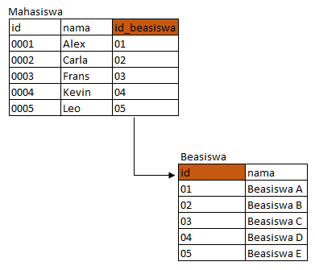
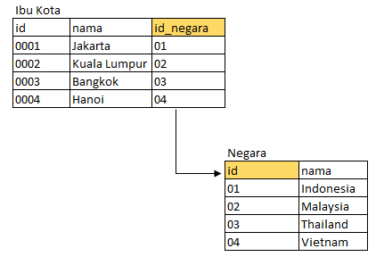
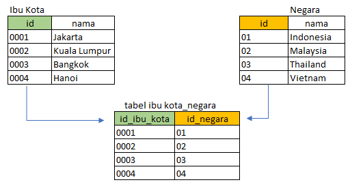
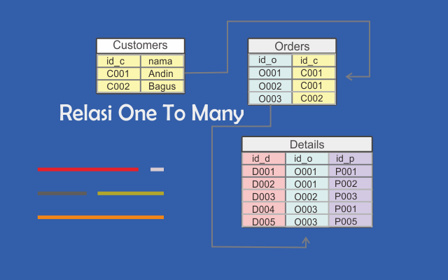
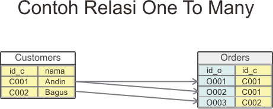
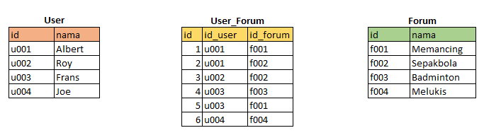

>Ini adalah Rangkuman dari minggu ke **6** mulai dari minggu web dev basic atau minggu pertama BE-DEV

## Rangkuman BE-DEV Week 1
>### Modul yang dipelajari
>- Web Server & Restful API
>- Node JS Essential
>- Express JS
>- Database Design with mysql

## Web Server & Restful API
Web server pada sisi hardware merupakan pengalokasian resource komputer untuk menyimpan web server software dan component file dan konten dari web application(HTML, images, css, js file).  Web server mendukung komunikasi (client-server)dengan device lain yg dikonfigurasi dari sisi software.
Web server pada sisi software adalah barisan kode yang dibuat untuk mendukung web server memberi layanan data. Berfungsi menerima http atau https request dari client atau browser dan mengirimkan respon berdasarkan request tersebut dalam bentuk web
### Tipe software Architecture
Banyak sekali istilah yang digunakan mengenai konsep software architecture ini. 2 tier, 3 tier, n tier application kemudian monolith dan microservices. Monolith adalah dimana application(frontend, backend(logic reside), database ) ada dalam satu codebase bahasa kerennya. Microservice adalah dimana backend dan database dapat dipecah pecah dan saling independen/terisolasi codebase nya tetapi dapat saling berinteraksi satu sama lain.
[resource1](https://www.educative.io/blog/how-to-design-a-web-application-software-architecture-101)
[resource2](https://www.quora.com/What-are-some-examples-of-web-applications-that-should-be-designed-as-monolithic-instead-of-microservices)

### Data Exchange dengan API
Ada banyak tipe/format api untuk melakukan data exchange, masing masing memiliki kelebihan dan kekurangan berdasarkan usecase yang akan digunakan dalam aplikasi. Tipe/format Api yaitu SOAP, REST, Grapql, rpc dan grpc.
[resource1](https://www.redhat.com/architect/apis-soap-rest-graphql-grpc)
**REST** mensupport exchange data dengan format **xml, json, html dan plain text.**
**REST** atau Representational state transfer salah satu arsitektur design untuk membuat web service
#### Pilar milik rest
1. Uniform 
2. Client-server
3. stateless
4. cacheable
5. layered system 
6. code on demand (optional)

> ### Api yang menerapkan pilar di atas disebut Restful API

| HTTP method | status code        |
| ----------- | ------------------ |
| GET         | 2xx - success      |
| POST        | 3xx - redirect     |
| Delete      | 4xx - client error |
| PUT         | 5xx - server error |
| PATCH(partial)            |                    |
[[HTTP Status Codes]]

Rules penulisan endpoint API 
- pakai huruf kecil
- gunakan dash(-) jika lebih dari 1 kata e.g. /product-designs/
- dibuat jika ada banyak data
- dibuat singular jika ada 1 data

| Method | Endpoint          | Description        |
| ------ | ----------------- | ------------------ |
| GET    | api/products      | list of products   |
| GET    | api/products/{id} | view a product     |
| POST   | api/products      | create new product |
| PUT    | api/products/{id} | Update a product   |
| DELETE | api/products/{id} | Delete a product   |

## Node JS Essential
brief history: Node js adalah sebuah revolusi , dimana dulunya js hanya dapat berjalan di browser (karena ada misalnya v8 engine di chrome), sekarang dapat berjalan di atas os. Beberapa Core modules dapat mengakses file system, os, console, hingga events. 
### Basic Import 
```node
require("<package_name>")
require("path_component_code")
```

### Basic Install
```bash
// install package/library
npm i <package_name>

// install only in developing use -D or --save-dev
npm i -D <package_name>
```
[npm-cli](https://docs.npmjs.com/cli/v8/commands/npm-install)
[npm](https://www.npmjs.com/)

## Express JS
Prerequisite: nodejs runtime
[node download](https://nodejs.org/en/)

### Basic install locally
1. `mkdir test`
2. `cd test`
3. `npm init` (optional)
`// install express`
4. `npm i express`   
`// install nodemon` 
5. `npm i -D nodemon` (auto restart node server)

### instansiasi router
```node
const express = require("express");
const router = express.Router();

// example
router.get("/", (req, rest) => {
  rest.send({
    status: "succes",
    message: "welcome",
  });
}); 
```

### Middleware, router, endpoint dan controller
```node
// Middleware series function yang di call dan diperiksa saat user meng-hit endpoint tertentu apabila memenuhi akan dilanjutkan ke function selanjutnya
// to use, use syntax .use()
// use next(), apabila ada callback lagi

// isi index.js dari folder router
const express = require("express");
const router = express.Router();
const moviesRoute = require("./movies.route");

router.use("/movies", moviesRoute);

//isi moviesRoute from ./movies.route.js 
const express = require("express");
const router = express.Router();

const {
  getMovies,
  getMoviebyID,
} = require("../controller/movies.controller");
// localhost:8000/movies
router.get("/", getMovies);

// localhost:7000/movies/:id
router.get("/:id", getMoviebyID);
module.exports = router;

// isi function getMovies dan getMoviebyID dari controller/movies.controller.js
const movies = [
  {
    id: 1,
    title: "Tenet",
  },
  {
    id: 2,
    title: "Inception",
  },
];

module.exports = {
  // get all movies
  getMovies: (req, res) => {
    res.send({
      status: "succes",
      data: movies,
    });
  },
  // get movie by id
  getMoviebyID: (req, res) => {
    const params = req.params;
    const data = movies.find((item) => item.id == params.id);
    res.send({
      status: "succes",
      data,
    });
  },
  // add movie
  addMovie: (req, res) => {
    const data = req.body;
    movies.push(data);
    req.status(201);
    res.send({
      status: "succes",
      message: "succes add data",
      data: movies,
    });
  },
}; 
//
```


## Database Design with Mysql

### Relation

[Cardinality Optionality Explained](https://www.freecodecamp.org/news/crows-foot-notation-relationship-symbols-and-how-to-read-diagrams/)
- one to one( 1 )
  Contohnya
 1. Siswa dan beasiswa
    
    Untuk menerapkan relasi one to one dari gambar di atas maka `id_beasiswa` sebagai foreign key di tabel siswa dibuat unique.
 2. Negara dan ibukota
    
    Dapat menggunakan pivot table

Dalam penerapannya baik menggunakan tabel perantara atau tidak saat membuat tabel one to one data pada tabelnya berbentuk unique index.
  [learn more](https://www.indonetsource.com/relasi-one-to-one-dan-contoh/)
  
- one to many
  Contohnya:
  
  
  1 customer dapat memiliki lebih dari 1 order, 1 order hanya dapat dimiliki 1 cutomer. 
  [learn more](https://www.indonetsource.com/relasi-one-to-many/)
  
- many to many
  dapat diresolve pada logical data model(atau yang nanti jadi ERD) menjadi 2 entity one to many relation dengan entitity pivot/konjungsi.
  Contohnya User dan Forum
  
  
  
  [learn more](https://www.indonetsource.com/contoh-penerapan-relasi-many-to-many/)

## DB Normalization
| Level Normalisasi | Syarat                                                                   |
| ----------------- | ------------------------------------------------------------------------ |
| 1NF               | - ga ada urutan dalam penyimpanan data                                   |
|                   | tiap kolom tipe data sama                                                |
|                   | tiap kolom harus berisi nilai tunggal                                    |
|                   | harus ada primary key                                                    |
|                   |                                                                          |
| 2NF               | harus dalam bentuk 1NF                                                   |
|                   | tidal ada partial dependency(atribut yg tidak ada hubungan akan dipisah) |
|                   |                                                                          |
| 3NF               | Harus dalam bentuk 2NF                                                       |
|                   |                       tidak ada transtitif depedency(atribut selain primary key tidak bergantung pada atribut selain primary key lain)                                                   |

straight point
| Level Normalisasi | Syarat                                                  |
| ----------------- | ------------------------------------------------------- |
| 1NF               | - no repeating values                                   |
|                   | - no repeating groups                                   |
| 2NF               | Any non-key field should be dependent on the entire primary key |
| 3NF              |      No non-key value is dependent on any other non-key values
[DB Normalization](https://drive.google.com/file/d/1INBhrFxqFTJZT2ZlaZOKSMdLM1pAh28j/view)
[Example by kak Auzan](https://github.com/tech-4-impact-batch-3/materi-BE/tree/main/04-design-database)


