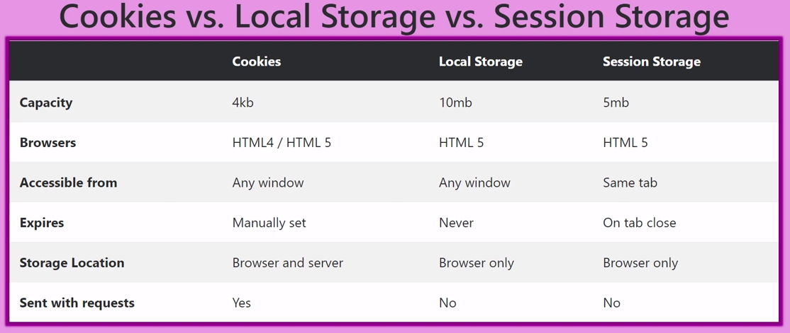

# Rangkuman Week 3
> ## Modul yang Dipelajari: Full JS
> - Array dan array multi-dimensi
> - Objects  
> - Modules
> - Recursive
> - Async callback
> - Web-storage

## Array dan Array Multidimensi
 Contoh Array 
`let arr= [1, "Nice", false]`
Untuk mengakses array diatas yaitu dapat seperti `arr[0]` untuk data pertama.
Untuk mengubah data pertama dapat seperti `arr[0]= "hello"`, akan mengubah `arr` menjadi seperti `['hello', 'Nice', false]`.

### Array Methods
Beberapa array Method
```js
let arrBuah = [ "jeruk", "semangka", "pepaya", "rambutan", "melon", "belimbing"
]
// menambahkan data...................

arrBuah.push("duku") // di akhir

arrBuah.unshift("anggur") // di awal

// menghapus data.....................

arrBuah.pop() // di akhir

arrBuah.shift() // di awal

// menghapus di tengah................

// splice, merubah data arraynya

// dan dapat mereturn nilai

arrBuah.splice(2, 0, "buah naga")

console.log(arrBuah) //[ 'jeruk', 'semangka', 'buah naga', 'pepaya', 'rambutan', "melon", 'belimbing']

// slice, ambil data dgn cara mengcopy

let slice = arrBuah.slice(2, 4)

console.log(arrBuah);

console.log(slice)
```
### Array Loop Method
Beberapa cara mengiterasi array dengan `for`, `for of`,  `forEach` dan `map`.
```js
// for

for (let i = 0; i < arrBuah.length; i++) {

console.log(arrBuah[i])

}

for (let i = arrBuah.length - 1; i >= 0; i--) {

console.log(arrBuah[i])

}

// for of

for (let buah of arrBuah){

console.log(buah);

}

// forEach......................

// tanpa return

arrBuah.forEach((item) => {

console.log(item)

})

// map..........................

// bisa dengan return

let buahSegar = arrBuah.map((item) => {

return item + " " + "segar"

})

console.log(buahSegar)

```
### Array Multidimensi
Array didalam Array
Contoh 
```js
let arrMulti = [
["nama", "alpha"],
["umur", 17],
["kelas", "JS"],
]
```
Cara akses
```js
console.log(arrMulti[0][1]); //alpha
console.log(arrMulti[2][1]); // JS

arrMulti[2][1] = "CSS"

console.log(arrMulti); //[[ 'nama', 'alpha' ], [ 'umur', 17 ], [ 'kelas', 'CSS' ]]
```
## Objects dan Object of array
Contoh Object
```js
let nama_obj = {
	key1: "value",
	key2: "value2",
};
```
### Method in Object 
```js
const greeting = {
	welcome: function () {
		return "halo selamat datang";
	},
	afterPay: function () {
		return "Terimakasih sudah membeli produk kami";
	},
};
// access nya

console.log(greeting.welcome());

console.log(greeting.afterPay());
```
### Nested Object
```js
let buku = {
	judul: "tips jago javascript",
	tahun: 2022,
	penulis: {
		penulis1: {
			nama: "Reyhan",
			umur: 28,
			kota: "jakarta",
		},
		penulis2: {
			nama: "aby",
			umur: 25,
			kota: "bandung",
		},
	},
};

// accesnya
console.log(buku);
console.log(buku.penulis.penulis1.nama);
console.log(buku.penulis.penulis2.umur);
```
### Loop Object Method
`for in`
```js
// for in
let siswa = {
nama: "Reyhan",
umur: 22,
asal: "jakarta",
hobi: "membaca",
};

console.log(siswa);
for (let key in siswa) {
	console.log(siswa[key]);
	// console.log(key);
	//siswa[key] -> siswa['nama'] -> siswa['umur'] -> siswa['asal']
}
```
### Array of Object
Strukturnya banyak dipakai pada format api, jadi bagus untuk bisa dapat mengaksesnya.
Contoh
```js
let users = [
	{
		nama: "dila",
		umur: 17,
		alamat: "bandung",
	},
	
	{
		nama: "audzan",
		umur: 18,
		alamat: "jakarta",
	},
	
	{
		nama: "dolton",
		umur: 16,
		alamat: "sulawesi",
	},
];

console.log(users);

let data = users.map((el) => {
	// console.log(el.nama);
	el.status = "aktif";
	return el;
});

// console.log(data);
```
## Modules
>- Modules menitik beratkan pada pemisahan kode program dari fungsionalitasnya menjadi independent dan dapat di reuse module-nya untuk melakukan hanya 1 fungsionalitas. 
>- Modules banyak digunakan saat menggunakan library

>- Keyword `import`,  `export` dan `export default` pada javascript digunakan untuk dapat membuat dan menggunakan module.
>- `import` -> memasukkan
>- `export` -> mengeluarkan
>- `export default` -> module utama pada suatu file/module

pada pencantuman file/module js pada html sebagai module dapat menggunakan syntax seperti 
```html
<script src="" type="module"></script>
```

contoh 
syntax dasar `import`
`import <nama_module_utama>, {<array1>, <function2>} from <path_file>`
```
import 
```

syntax dasar `export` dan `export default`
```js

let motor = ["suzuki", "yamaha", "honda", "kawasaki"]

const smartPhone = ["sony", "samsung", "fujitsu", "LG"]

let entertainment = ["anime", "manga", "wibu", "dorama"]

// export cara 1
export function greeting(){...}

// export cara 2
export {motor, smartphone, greeting}

export default entertainment
```

## Recursive
Recursive biasa diimplementasikan dengan function yang terus memanggil dirinya sendiri sampai suatu kondisi tercapai. Kondisi yang ingin dicapai ini disebut base case, dimana function berhenti. Recursive lebih banyak digunakan untuk rumusan matematis. Jadi pada recursive minimal ada 2 kondisi
- base case -> kondisi terkecil, function stop
- recursive case-> kondisi memanggil diri sendiri
Contoh
```js
function faktorial(n) {
	if (n == 1) {
		return 1
	} else {
		return n * faktorial(n - 1)
	}
}
console.log(faktorial(5))
// walk the code
//n= 5
// 5 * faktorial(n-1) * faktorial(n-2) * faktorial(n-3) * faktorial(n-4), mencapai base case. recursive stop
```
## Async callback
> ### Javascript adalah bahasa yang single-thread, non-blocking dan asynchronous.

> - Bahasa mudah nya kita ingin mentrigger beberapa fungsi, tetapi kita ingin fungsi yang lebih cepat dieksekusi diduluankan, dan fungsi yang lebih lama dilanjutkan setelahnya, apabila ada fungsi lain maka 

> - Membaca kode dari atas ke bawah, tetapi urutan eksekusi kode bergantung pada lama waktu eksekusi, misal di kode dipanggil fungsi a tetapi dikasi timeout 1,2 s dan dipanggil fungsi b tanpa timeout. urutan hasilnya yaitu fungsi b kemudian fungsi a

- Callback -> fungsi yang dijadikan sebagai argumen pada fungsi lain
```js
// pembuatan promise.............

let nontonPromise = new Promise((resolve, reject) => {
	if (true) {
		resolve("nonton terpenuhi") // berhasil
	}
	reject("gagal"); // gagal
});

// eksekusi proses..............
nontonPromise
	.then((result) => {
		console.log(result);
		return `${result} bareng doi`
	})
	.then((result) => {
		console.log(result)
	})
	.catch((err) => {
		console.log(err);
	});
```
## Web-storage
Dalam browser terdapat tempat untuk kita menyimpan data tertentu, tempat itu yaitu local storage, session storage dan cookies. Untuk perbedaan ketiganya dapat dilihat di bawah. 
Disini akan lebih difokuskan mengenai local storage. Data yang ada di local storage akan tetap disimpan browser walaupun kita sudah menutup browser. 

- keyword `localStorage` dapat menampung seperti tema yang dipakai dll
- `localStorage` menampung dalam format `key` dan `value` 
### `localStorage` Method
- `getItem(<key_str>)`
- `setItem(<key_str>, <value_str>)`
- `removeItem(<key_str>)`
- `clear()` //remove all key value
- `key(<index_number>)`
